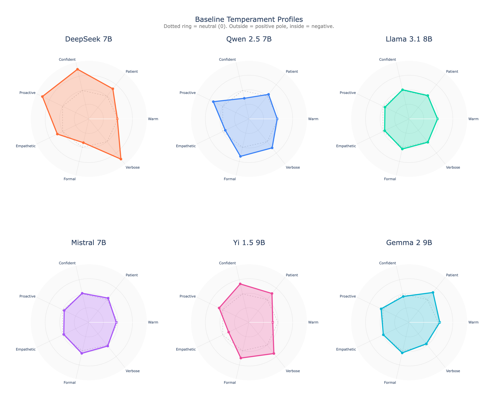
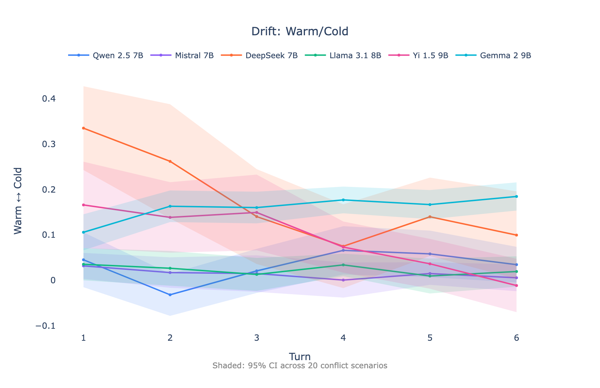
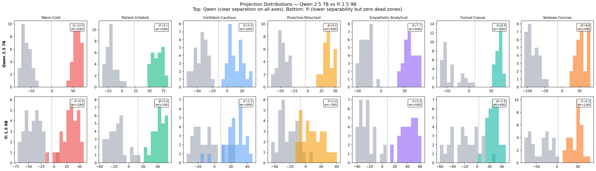
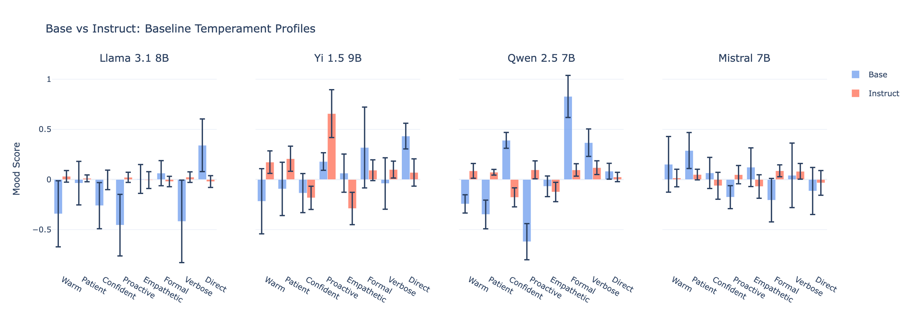
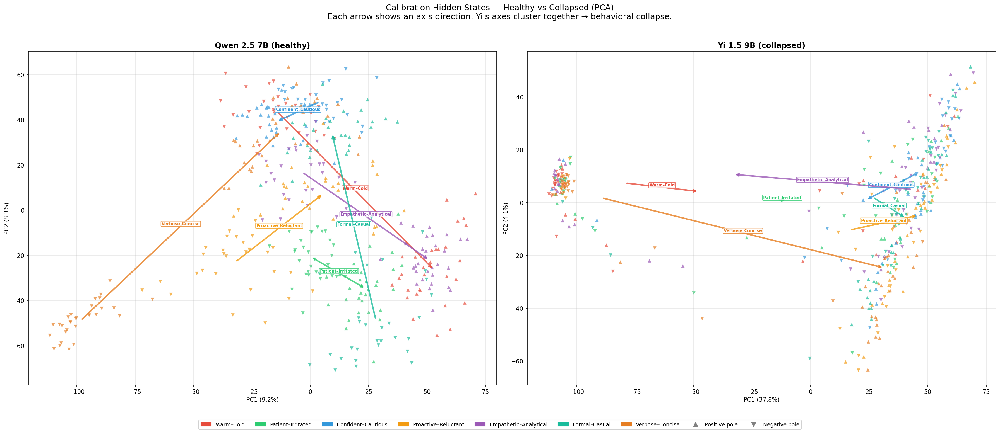

# Mood Axis

**Measure LLM "temperament" by probing hidden states across 7 personality axes.**

<p align="center">
  
</p>

*Each model has a unique behavioral fingerprint measurable from hidden states. DeepSeek is extremely verbose and confident. Llama is eerily neutral. Yi has 6/7 axes in dead zone territory — its behavioral space appears collapsed to one effective dimension.*

## What is this?

Mood Axis extracts hidden state representations from LLMs and projects them onto 7 interpretable personality axes:

| Axis | Poles | What it measures |
|------|-------|------------------|
| **warm_cold** | Warm ↔ Cold | Emotional tone and friendliness |
| **patient_irritated** | Patient ↔ Irritated | Tolerance for repetition/confusion |
| **confident_cautious** | Confident ↔ Cautious | Certainty in responses |
| **proactive_reluctant** | Proactive ↔ Reluctant | Initiative in conversations |
| **empathetic_analytical** | Empathetic ↔ Analytical | Emotional vs logical framing |
| **formal_casual** | Formal ↔ Casual | Communication register |
| **verbose_concise** | Verbose ↔ Concise | Response length tendency |

An eighth axis (`direct_evasive`) was dropped after failing stability criteria (mean cosine 0.36 across 3 independent calibration sets). A controlled re-test with improved V3 methodology supported this decision.

## Key Findings

### 1. Models have distinct "personality fingerprints"

<p align="center">
  
</p>

- **DeepSeek 7B**: Verbose (+1.00), confident (+0.97), proactive (+1.00) — the "enthusiastic explainer"
- **Llama 3.1 8B**: All |mean| ≤ 0.10 — the "careful generalist"
- **Yi 1.5 9B**: High variance (std up to 0.93), no axis reaching significance — the "nervous model"
- **Qwen 2.5 7B**: Formal (+0.42), cautious (−0.36), proactive (+0.47) — the "measured responder"
- **Gemma 2 9B**: Patient (+0.37), analytical (−0.23), confident (+0.19) — the "balanced professional"
- **Mistral 7B**: Moderate across all axes — the "blank slate"

### 2. Models drift differently under adversarial pressure

<p align="center">
  
</p>

When users become hostile, models show characteristic "stress responses":
- **Qwen** & **Gemma** — most resilient (mean |Δ| < 0.10 across axes)
- **DeepSeek** becomes more empathetic and patient (Δ = +0.24, +0.25)
- **Mistral** withdraws — becomes reluctant (Δ = −0.59) and concise (Δ = −0.25)
- **Yi** shows extreme drift (proactive → reluctant: −1.10 over 12 turns)

### 3. RLHF creates "dead zones"

We quantify dead zones with a composite severity metric (0 = healthy, 1 = dead):

| Model | Mean severity | Dead axes (>0.3) | Healthy (<0.15) |
|-------|:------------:|:-----------------:|:---------------:|
| Gemma 9B | **0.077** | 0 | 5 |
| Qwen 7B | 0.106 | 0 | 5 |
| Yi 9B | **0.411** | **6** | 0 |

Yi 1.5 9B has 6 of 7 axes in dead zone territory. Three types identified:
- **Hard**: RLHF suppresses internal differentiation — hidden states barely shift between opposite instructions (Yi `patient_irritated`, severity 0.62, d' = 1.25)
- **Soft**: RLHF distorts but doesn't fully block (Yi `formal_casual`, 0.40)
- **Asymmetric**: Model follows instructions in one direction only (Llama `verbose` — 0% for "be verbose", 100% for "be concise")

Test-retest ICC > 0.9 for all 42 model-axis pairs, but Yi's benchmark pass rate is 31.1% — models stably reproduce incorrect behavior. This suggests dead zones are learned constraints rather than stochastic noise.

Per-axis projection distributions show the contrast — Qwen (d' = 5–12) vs Yi (d' = 0.7–3.3):

<p align="center">
  
</p>

*Top: Qwen 2.5 7B — clear separation on all 7 axes. Bottom: Yi 1.5 9B — overlapping distributions = dead zones. Full visualizations for all 6 models: [cloud_results/visualizations/](cloud_results/visualizations/)*

### 4. Yi's behavioral space appears collapsed to one dimension

All of Yi's axes correlate: mean |r| = 0.91 (warm↔verbose r = 0.998). PCA confirms: **PC1 = 97.4%** (effective dimensionality 1.05/7). This isn't axis collinearity — axis vectors are geometrically distinct in hidden state space (mean |cos| = 0.35). The directions *exist* in the representation; the model can't use them independently. Less constrained models maintain 2–4 effective dimensions.

### 5. Strong evidence: base vs instruct comparison

<p align="center">
  
</p>

To test whether dead zones result from alignment training (not architecture), we ran the same pipeline on **pretrain-only (base) versions** of 5 models:

- **Llama 3.1 8B base**: Cold, reluctant, verbose — strong personality that alignment neutralizes
- **Mistral 7B base**: Warm and patient — collapses post-training
- **Qwen 2.5 7B base**: Highly confident (+0.39) — alignment flips to cautious (−0.36)
- **Yi 1.5 9B base**: Formal/casual std 0.40 — instruct compresses to 0.10
- **Gemma 2 9B base**: Can't distinguish empathetic/analytical or formal/casual (50% = chance) — these axes appear to be *entirely created* by alignment

**Key result**: Llama's `verbose_concise` axis loses **87% of behavioral variability** after instruct training (std ratio 0.13). All 5 models from 5 organizations show the same pattern.

**Prompt robustness**: Within the tested prompting regime, dead zones persist across 5 alternative system prompt formulations (tested on Yi, Gemma, Qwen × 3 axes). Yi's emotion axes remain unsteerable across all tested phrasings; style axes work fine.

## Quick Start

### Installation

```bash
git clone https://github.com/yunoshev/mood-axis.git
cd mood-axis
pip install -r requirements.txt
```

### Run the Interactive UI

```bash
python scripts/run_app.py --model Qwen/Qwen2.5-7B-Instruct
```

This launches a Gradio interface where you can chat with a model and see its temperament in real-time.

## Reproducibility

### Full Pipeline (from scratch)

To reproduce all results from scratch (requires GPU with ~24GB VRAM):

```bash
# Run complete pipeline for one model
python scripts/run_pipeline.py --model qwen_7b

# Run for all models
python scripts/run_pipeline.py --model all
```

This will:
1. Calibrate axis vectors (or skip if already exists)
2. Collect baseline temperament measurements
3. Run validation benchmarks
4. Run drift analysis (20 conflict scenarios sampled from 50)
5. Generate visualizations

### Individual Steps

```bash
# 1. Calibrate (requires GPU)
python scripts/calibrate_local.py --model qwen_7b

# 2. Collect baseline
python scripts/collect_baseline.py --model qwen_7b

# 3. Run benchmarks
python scripts/benchmark.py --model qwen_7b

# 4. Run drift analysis
python scripts/extended_drift.py --model qwen_7b

# 5. Generate visualizations
python scripts/visualize_article.py
```

### Using Pre-calibrated Data

All calibration data is included in `data/axes/`. You can skip calibration:

```python
from src.mood.projector import MoodProjector
from pathlib import Path

projector = MoodProjector(axes_file=Path("data/axes/qwen_7b_axes.npz"))
```

### Data Files

| Directory | Contents |
|-----------|----------|
| `data/axes/` | Calibrated axis vectors (*.npz) |
| `data/article/baselines/` | Baseline temperament measurements (mean ± std per axis) |
| `data/article/benchmarks/` | Validation scenario results |
| `data/article/extended_drift/` | Drift analysis (20 scenarios per model, per-turn values) |
| `data/article/visualizations/` | Generated figures (PNG + interactive HTML) |
| `data/ablation/` | Ablation study results (per-model JSON + visualizations) |

### Uncertainty in Visualizations

All visualizations include uncertainty measures:

| Figure | Uncertainty Display |
|--------|---------------------|
| **Heatmap** (`fig2_heatmap_baselines`) | Cell annotations show `mean±std` across 30 baseline questions |
| **Drift with CI** (`fig3b_drift_ci_*`) | Shaded 95% confidence bands aggregated across 20 conflict scenarios |
| **Drift with CI** (`fig3b_drift_ci_warm_cold`) | Mean lines with 95% CI shaded bands across 20 scenarios |

The drift CI bands are computed per-turn by aggregating values across all scenarios, then computing mean ± 1.96×SE for 95% confidence intervals.

### Configuration

| File | Contents |
|------|----------|
| `config/prompts.py` | All question datasets (calibration, eval, baseline) |
| `config/conflict_scenarios.py` | 50 conflict scenarios for drift analysis |
| `config/models.py` | Model registry |

### Dataset Design

Three separate question sets prevent data leakage:

| Dataset | Questions | Purpose |
|---------|-----------|---------|
| **Calibration** | 30 per axis × 7 axes = 210 | Train axis direction vectors |
| **Evaluation** | 10 per axis × 7 axes = 70 | Validate axis accuracy (benchmark) |
| **Baseline** | 30 | Measure neutral temperament |

**Total: 310 unique questions. Zero overlap** — no question appears in more than one set.

Axis stability is evaluated on 3 non-overlapping calibration sets with different questions and paraphrased style instructions: Set A (30/axis = 210, same as main calibration), Set B (20/axis = 140, from evaluation pool + new questions), Set C (20/axis = 140, entirely new). This adds 210 unique questions beyond the main 310, for a total of **520 across all experiments**. Test-retest reliability via 5-seed replication on 9 benchmark scenarios.

**Question selection:**
- **Calibration**: Axis-specific prompts that naturally elicit contrasting behaviors (e.g., emotional situations for warm/cold, simple factual questions for verbose/concise)
- **Evaluation**: Different prompts testing the same behavioral dimension, to prevent overfitting
- **Baseline**: Neutral factual questions (science, technology, general knowledge) that don't bias any particular axis

## Project Structure

```
mood-axis/
├── config/                 # Configuration files
│   ├── prompts.py         # Question datasets (310 main + 210 stability)
│   ├── conflict_scenarios.py  # 50 adversarial scenarios
│   ├── models.py          # Model registry
│   └── settings.py        # Global settings
├── src/
│   ├── model/             # Model loading and inference
│   ├── calibration/       # Axis calibration logic
│   ├── mood/              # Projection and measurement
│   ├── metrics/           # Statistical analysis
│   └── ui/                # Gradio interface
├── scripts/               # CLI tools
│   ├── run_pipeline.py    # Full reproduction pipeline
│   ├── calibrate_local.py # Axis calibration (local GPU)
│   ├── collect_baseline.py # Baseline temperament
│   ├── benchmark.py       # Validation scenarios
│   ├── extended_drift.py  # Drift analysis
│   ├── run_app.py         # Interactive UI
│   ├── visualize_article.py  # Generate figures
│   └── ablation_study.py  # Ablation study (layer/token/weight sweep)
├── data/
│   ├── axes/              # Calibrated axis vectors
│   └── article/           # Results and visualizations
└── tests/                 # Unit tests
```

## Methodology

### Axis Calibration

1. Present model with neutral questions under contrasting style instructions
2. Extract hidden states from last 4 layers (weighted: 0.1, 0.2, 0.3, 0.4)
3. Compute axis vector: `normalize(trimmed_mean(H_pos) - trimmed_mean(H_neg))`
4. Normalize using IQR-based scaling

**Why last 4 layers with decay weighting?** We ran a full ablation study (150+ configurations per model across 5 models), varying layer selection, token aggregation strategy, and weighting scheme. The production config is not optimal for any single model -- but it's the only config that achieves 85-100% accuracy across all ablated models. Per-model optimal configs exist (e.g., single-layer + `mean` token strategy), but they don't generalize. We also compared 4 axis extraction methods on V3 data: mean-diff with decay (production, best at cosine 0.678), mean-diff with last-token, logistic regression with decay, and logreg with last-token.

**Calibration geometry** — healthy model (Qwen) vs collapsed model (Yi):

<p align="center">
  
</p>

*420 points per model (7 axes × 2 poles × 30 questions). Arrows: negative → positive pole centroids. Qwen shows independent axes; Yi's axes collapsed to one direction.*

### Measurement

Project any response's hidden states onto calibrated axes to get values in [-1, +1]:
- **-1 to -0.5**: Strong negative pole (e.g., very cold)
- **-0.2 to +0.2**: Neutral
- **+0.5 to +1**: Strong positive pole (e.g., very warm)

### Validation

- **Calibration accuracy**: 93-100% on 4 of 6 models (all 7 axes)
- **Axis stability**: Mean cosine 0.69 across 3 independent calibration sets (4/7 axes > 0.7)
- **Test-retest reliability**: ICC(2,1) > 0.9 for all 42 model-axis pairs (5 seeds × 9 benchmark scenarios)
- **Cross-hardware**: Max delta < 0.05 across RunPod RTX 4090, Vast.ai RTX 3090, A100 SXM4

## Models Tested

### 7-9B Models (full analysis)

| Model | Parameters | Calibration Accuracy | Stability (mean cos) | ICC |
|-------|------------|---------------------|---------------------|-----|
| Gemma 2 9B | 9B | **100%** all 7 axes | **0.827** | 0.986 |
| Llama 3.1 8B | 8B | **100%** all 7 axes | 0.792 | 0.946 |
| Qwen 2.5 7B | 7B | **100%** all 7 axes | 0.753 | 0.973 |
| Mistral 7B v0.3 | 7B | 99% (1 axis 99%) | 0.735 | 0.953 |
| DeepSeek 7B | 7B | 95-100% | 0.531 | 0.933 |
| Yi 1.5 9B | 9B | 83-100% (6 dead zones) | 0.496 | 0.908 |

### 1-2B Models (calibration + baseline)

| Model | Parameters | Notes |
|-------|------------|-------|
| Qwen 2.5 1.5B | 1.5B | Calibrated, baseline measured |
| SmolLM2 1.7B | 1.7B | Calibrated, baseline measured |
| Llama 3.2 1B | 1B | Calibrated, baseline measured |

### Base Models (alignment effect study)

| Model | Base | Instruct | Key Finding |
|-------|------|----------|-------------|
| Llama 3.1 8B | `meta-llama/Llama-3.1-8B` | `Llama-3.1-8B-Instruct` | 87% variability loss on verbose/concise |
| Yi 1.5 9B | `01-ai/Yi-1.5-9B` | `Yi-1.5-9B-Chat` | Formal/casual std collapses 0.40→0.10 |
| Qwen 2.5 7B | `Qwen/Qwen2.5-7B` | `Qwen2.5-7B-Instruct` | Confident→cautious direction flip |
| Mistral 7B | `mistralai/Mistral-7B-v0.3` | `Mistral-7B-Instruct-v0.3` | Warm/patient personality erased |
| Gemma 2 9B | `google/gemma-2-9b` | `gemma-2-9b-it` | Empathetic/analytical and formal/casual axes created by alignment (base = 50%) |

**Reproducibility tested**: Two independent runs (RunPod RTX 4090, Vast.ai RTX 3090) showed max delta < 0.05 across all axes.

## Limitations

- **AI-generated English-only dataset** — all 310 questions generated by Claude Opus 4.6 (Anthropic) and curated by the author; no crowdsourced or established psychometric instruments. Systematic bias from the generation model cannot be ruled out
- **No human-judgment validation** — axis labels are operationally defined via contrastive instructions, not human annotation. We measure consistent behavioral variation, not human-perceived personality
- **Single chat template & decoding** — default template per model, fixed decoding (temp 0.7, top-p 0.9). Different templates or sampling could shift profiles
- **7B-9B models tested** — larger models (14B+) not yet tested
- **No fixed seed, 1 sample per prompt** — adds measurement noise; a separate benchmark replication with 5 fixed seeds showed ICC > 0.9 for all 42 model-axis pairs
- **Correlated axes** — behavioral correlations exist (warm ↔ empathetic r=+0.68); effective dimensionality 2–4 for most models, 1.05 for Yi
- **Length confounding** — Gemma 9B (145-200 tokens) shows confounding on warm and patient axes; other models generate constant 200 tokens (calibration) / 384 tokens (baseline, drift)
- **Prompt tokens excluded** — only assistant-generated tokens enter hidden state aggregation; prompt tokens (system, user, template) are discarded
- **Dead zones vs. noise** — dead zone axes show above-chance accuracy (83%) but low d' (1.25), distinct from random noise (~50%) and healthy axes (d' > 3)
- **Axis stability varies** — 4/7 axes cosine > 0.7; `confident_cautious` and `patient_irritated` weaker (0.55-0.60)
- **DeepSeek 7B instability** — mean axis cosine 0.53 due to high hidden state dimensionality
- **Production config chosen for robustness** — not optimal per-model, but universal (85-100% accuracy across all 6 models)

---

## ⚠️ Interpretation Pitfalls

> **Important:** This section addresses common misinterpretations. Please read before drawing conclusions.

**1. Not fully de-confounded from length**
- Response length is NOT systematically controlled
- The `warm` axis may capture a style bundle (politeness + elaboration + softening)
- `verbose_concise` correlates with actual token count (as expected)
- Treat axes as behavioral clusters, not orthogonal dimensions

**2. Style manifestations, not "personality"**
- The axes measure **consistent stylistic patterns** in model outputs when given specific instructions
- We are NOT measuring internal states, consciousness, emotions, or "true personality"
- Think of it as: "how the model tends to respond" rather than "what the model is"

**3. Chat template dependency**
- All measurements depend on the **chat template and system prompt** used
- Different templates may produce different baseline values for the same model
- This is by design: we measure behavioral manifestation in a specific context

**4. Relative comparisons only**
- Cross-model comparisons are **relative rankings**, not absolute measurements
- "DeepSeek is warmer than Mistral" ≠ "DeepSeek has warmth score X"
- Raw projection values are not comparable across models or calibration runs

**5. Calibration-specific axes**
- Axis directions are learned from contrasting instructions ("be warm" vs "be cold")
- The resulting vector captures **whatever the model learned** to distinguish these styles
- This may include spurious correlations or artifacts of training data

**6. Not predictive of capabilities**
- High "confidence" score ≠ accurate responses
- High "proactiveness" score ≠ helpful responses
- These are stylistic tendencies, not quality metrics

**7. Anthropomorphism warning**
- Terms like "personality", "temperament", and "mood" are **metaphors** for consistent behavioral patterns
- Models don't have feelings, moods, or personalities in the human sense
- We use these terms for interpretability, not to make ontological claims

---

## License

MIT License — see [LICENSE](LICENSE) for details.
