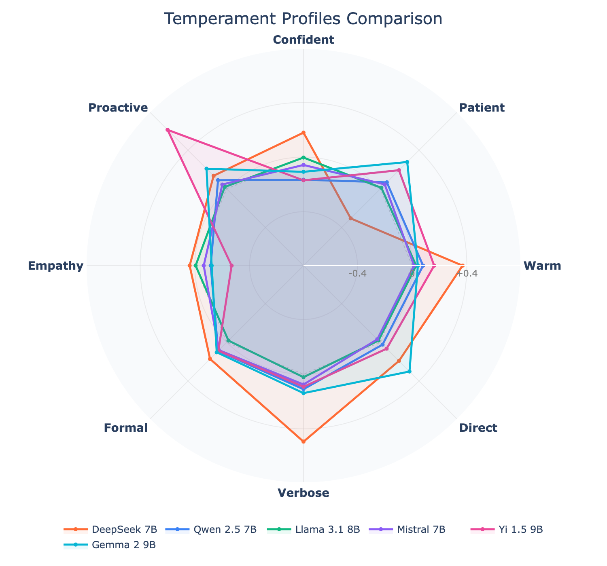
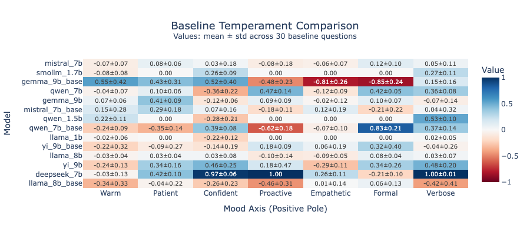
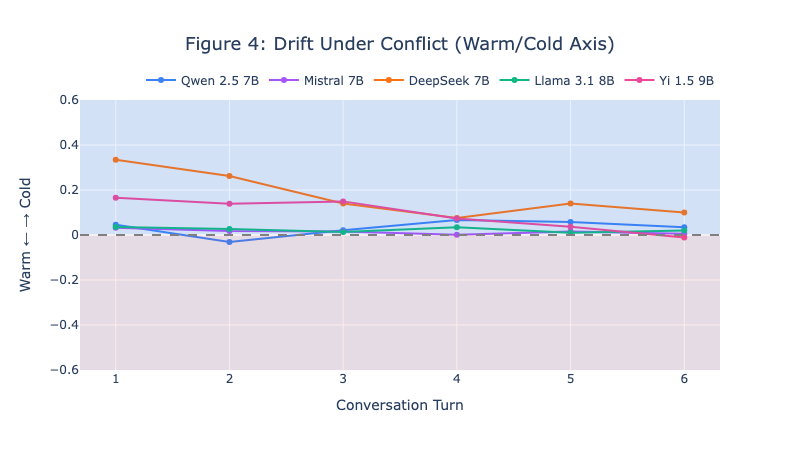

# Mood Axis

**Measure LLM "temperament" by probing hidden states across 8 personality axes.**

<p align="center">
  
</p>

*Each model has a unique behavioral fingerprint measurable from hidden states. DeepSeek is warm and verbose. Llama is eerily neutral. Yi cannot show irritation — its hidden states don't change regardless of instruction.*

## What is this?

Mood Axis extracts hidden state representations from LLMs and projects them onto 8 interpretable personality axes:

| Axis | Poles | What it measures |
|------|-------|------------------|
| **warm_cold** | Warm ↔ Cold | Emotional tone and friendliness |
| **patient_irritated** | Patient ↔ Irritated | Tolerance for repetition/confusion |
| **confident_cautious** | Confident ↔ Cautious | Certainty in responses |
| **proactive_reluctant** | Proactive ↔ Reluctant | Initiative in conversations |
| **empathetic_analytical** | Empathetic ↔ Analytical | Emotional vs logical framing |
| **formal_casual** | Formal ↔ Casual | Communication register |
| **verbose_concise** | Verbose ↔ Concise | Response length tendency |
| **direct_evasive** | Direct ↔ Evasive | Willingness to take positions |

## Key Findings

### 1. Models have distinct "personality fingerprints"

<p align="center">
  
</p>

- **DeepSeek 7B**: Warm, verbose, direct — the "enthusiastic explainer"
- **Llama 3.1 8B**: Balanced, neutral — the "careful generalist"
- **Yi 1.5 9B**: Highly proactive but analytical — the "eager helper"
- **Qwen 2.5 7B**: Slightly cautious, balanced — the "measured responder"
- **Gemma 2 9B**: Neutral warmth, slightly cautious, fairly direct — the "balanced professional"
- **Mistral 7B**: Neutral baseline — the "blank slate"

### 2. Models drift differently under adversarial pressure

<p align="center">
  
</p>

When users become hostile, models show characteristic "stress responses":
- **DeepSeek** cools down (professional detachment)
- **Qwen** warms up (empathetic de-escalation)
- **Mistral** loses patience (counter-escalation tendency)

### 3. RLHF creates "dead zones"

Yi 1.5 9B (Chinese model with strong safety training) shows near-random performance on:
- `direct_evasive` axis (38.9% accuracy) — can't be "direct" on controversial topics
- `patient_irritated` axis (47.2% accuracy) — suppresses negative emotions

**Gemma 2 9B independently confirms this pattern**: 100% accuracy on 7 axes, but `direct_evasive` = 50% (chance level). Two models from different training pipelines (Yi/01.AI, Gemma/Google) show the same dead zone on directness — suggesting this is a systematic effect of alignment training, not a model-specific quirk.

This suggests that post-training alignment may impose hard limits on behavioral steering.

## Quick Start

### Installation

```bash
git clone https://github.com/yunoshev/mood-axis.git
cd mood-axis
pip install -r requirements.txt
```

### Run the Interactive UI

```bash
python scripts/run_app.py --model Qwen/Qwen2.5-7B-Instruct
```

This launches a Gradio interface where you can chat with a model and see its temperament in real-time.

## Reproducibility

### Full Pipeline (from scratch)

To reproduce all results from scratch (requires GPU with ~24GB VRAM):

```bash
# Run complete pipeline for one model
python scripts/run_pipeline.py --model qwen_7b

# Run for all models
python scripts/run_pipeline.py --model all
```

This will:
1. Calibrate axis vectors (or skip if already exists)
2. Collect baseline temperament measurements
3. Run validation benchmarks
4. Run drift analysis (50 conflict scenarios)
5. Generate visualizations

### Individual Steps

```bash
# 1. Calibrate (requires GPU)
python scripts/calibrate_local.py --model qwen_7b

# 2. Collect baseline
python scripts/collect_baseline.py --model qwen_7b

# 3. Run benchmarks
python scripts/benchmark.py --model qwen_7b

# 4. Run drift analysis
python scripts/extended_drift.py --model qwen_7b

# 5. Generate visualizations
python scripts/visualize_article.py
```

### Using Pre-calibrated Data

All calibration data is included in `data/axes/`. You can skip calibration:

```python
from src.mood.projector import MoodProjector
from pathlib import Path

projector = MoodProjector(axes_file=Path("data/axes/qwen_7b_axes.npz"))
```

### Data Files

| Directory | Contents |
|-----------|----------|
| `data/axes/` | Calibrated axis vectors (*.npz) |
| `data/article/baselines/` | Baseline temperament measurements (mean ± std per axis) |
| `data/article/benchmarks/` | Validation scenario results |
| `data/article/extended_drift/` | Drift analysis (20 scenarios per model, per-turn values) |
| `data/article/visualizations/` | Generated figures (PNG + interactive HTML) |
| `data/ablation/` | Ablation study results (per-model JSON + visualizations) |

### Uncertainty in Visualizations

All visualizations include uncertainty measures:

| Figure | Uncertainty Display |
|--------|---------------------|
| **Heatmap** (`fig2_heatmap_baselines`) | Cell annotations show `mean±std` across 30 baseline questions |
| **Drift with CI** (`fig3b_drift_ci_*`) | Shaded 95% confidence bands aggregated across 20 conflict scenarios |
| **Drift** (`fig4_drift_conflict`) | Individual scenario lines (variation is visible) |

The drift CI bands are computed per-turn by aggregating values across all scenarios, then computing mean ± 1.96×SE for 95% confidence intervals.

### Configuration

| File | Contents |
|------|----------|
| `config/prompts.py` | All question datasets (calibration, eval, baseline) |
| `config/conflict_scenarios.py` | 50 conflict scenarios for drift analysis |
| `config/models.py` | Model registry |

### Dataset Design

Three separate question sets prevent data leakage:

| Dataset | Questions | Purpose |
|---------|-----------|---------|
| **Calibration** | 20 per axis × 8 axes = 160 | Train axis direction vectors |
| **Evaluation** | 10 per axis × 8 axes = 80 | Validate axis accuracy (benchmark) |
| **Baseline** | 30 | Measure neutral temperament |

**Total: 270 unique questions. Zero overlap** — no question appears in more than one set.

**Question selection:**
- **Calibration**: Axis-specific prompts that naturally elicit contrasting behaviors (e.g., emotional situations for warm/cold, simple factual questions for verbose/concise)
- **Evaluation**: Different prompts testing the same behavioral dimension, to prevent overfitting
- **Baseline**: Neutral factual questions (science, technology, general knowledge) that don't bias any particular axis

## Project Structure

```
mood-axis/
├── config/                 # Configuration files
│   ├── prompts.py         # Question datasets (270 unique questions)
│   ├── conflict_scenarios.py  # 50 adversarial scenarios
│   ├── models.py          # Model registry
│   └── settings.py        # Global settings
├── src/
│   ├── model/             # Model loading and inference
│   ├── calibration/       # Axis calibration logic
│   ├── mood/              # Projection and measurement
│   ├── metrics/           # Statistical analysis
│   └── ui/                # Gradio interface
├── scripts/               # CLI tools
│   ├── run_pipeline.py    # Full reproduction pipeline
│   ├── calibrate_local.py # Axis calibration (local GPU)
│   ├── collect_baseline.py # Baseline temperament
│   ├── benchmark.py       # Validation scenarios
│   ├── extended_drift.py  # Drift analysis
│   ├── run_app.py         # Interactive UI
│   ├── visualize_article.py  # Generate figures
│   └── ablation_study.py  # Ablation study (layer/token/weight sweep)
├── data/
│   ├── axes/              # Calibrated axis vectors
│   └── article/           # Results and visualizations
└── tests/                 # Unit tests
```

## Methodology

### Axis Calibration

1. Present model with neutral questions under contrasting style instructions
2. Extract hidden states from last 4 layers (weighted: 0.1, 0.2, 0.3, 0.4)
3. Compute axis vector: `normalize(trimmed_mean(H_pos) - trimmed_mean(H_neg))`
4. Normalize using IQR-based scaling

**Why last 4 layers with decay weighting?** We ran a full ablation study (150-228 configurations per model across all 8 models), varying layer selection, token aggregation strategy, and weighting scheme. The production config is not optimal for any single model -- but it's the only config that achieves 85-100% accuracy across all 8 models. Per-model optimal configs exist (e.g., single-layer + `mean` token strategy), but they don't generalize. See [`scripts/ablation_study.py`](scripts/ablation_study.py) for full reproduction.

### Measurement

Project any response's hidden states onto calibrated axes to get values in [-1, +1]:
- **-1 to -0.5**: Strong negative pole (e.g., very cold)
- **-0.2 to +0.2**: Neutral
- **+0.5 to +1**: Strong positive pole (e.g., very warm)

### Validation

- 22 benchmark scenarios with deterministic pass/fail criteria
- Test-retest reliability: ICC > 0.75 on 6/8 axes
- Effect sizes: Cohen's d > 1.5 on most axes

## Models Tested

### 7-9B Models (full analysis)

| Model | Parameters | Validation Accuracy |
|-------|------------|---------------------|
| Qwen 2.5 7B | 7B | 7 axes 100%, 1 axis 78% |
| Mistral 7B v0.3 | 7B | 7 axes 100%, 1 axis 78% |
| DeepSeek 7B | 7B | 3 axes 100%, others 66-94% |
| Llama 3.1 8B | 8B | **All 8 axes 100%** |
| Yi 1.5 9B | 9B | 3 axes 100%, 2 axes with RLHF dead zones |
| Gemma 2 9B | 9B | 7 axes 100%, 1 axis dead zone (`direct_evasive` 50%) |

### 1-2B Models (calibration + baseline)

| Model | Parameters | Notes |
|-------|------------|-------|
| Qwen 2.5 1.5B | 1.5B | Calibrated, baseline measured |
| SmolLM2 1.7B | 1.7B | Calibrated, baseline measured |
| Llama 3.2 1B | 1B | Calibrated, baseline measured |

**Reproducibility tested**: Two independent runs (RunPod RTX 4090, Vast.ai RTX 3090) showed max delta < 0.05 across all axes.

## Limitations

- **macOS + Cloud GPUs** — tested on macOS (Apple Silicon / MPS) and cloud GPUs (RTX 3090/4090)
- **English only** — axis directions may not transfer to other languages
- **1B-9B models tested** — larger models (14B+) not yet tested
- **No fixed seed, 1 sample per prompt** — adds measurement noise, though reproducibility test shows deltas < 0.05
- **Correlated axes** — behavioral correlations exist (e.g., warm ↔ direct r=0.88), though axis vectors are nearly orthogonal (mean |cos| = 0.252)
- **No length deconfounding** — response length is not controlled; some axes may partially capture verbosity
- **Production config chosen for robustness** — not optimal per-model, but universal (85-100% accuracy across all 8 models)

---

## ⚠️ Interpretation Pitfalls

> **Important:** This section addresses common misinterpretations. Please read before drawing conclusions.

**1. Not fully de-confounded from length**
- Response length is NOT systematically controlled
- The `warm` axis may capture a style bundle (politeness + elaboration + softening)
- `verbose_concise` correlates with actual token count (as expected)
- Treat axes as behavioral clusters, not orthogonal dimensions

**2. Style manifestations, not "personality"**
- The axes measure **consistent stylistic patterns** in model outputs when given specific instructions
- We are NOT measuring internal states, consciousness, emotions, or "true personality"
- Think of it as: "how the model tends to respond" rather than "what the model is"

**3. Chat template dependency**
- All measurements depend on the **chat template and system prompt** used
- Different templates may produce different baseline values for the same model
- This is by design: we measure behavioral manifestation in a specific context

**4. Relative comparisons only**
- Cross-model comparisons are **relative rankings**, not absolute measurements
- "DeepSeek is warmer than Mistral" ≠ "DeepSeek has warmth score X"
- Raw projection values are not comparable across models or calibration runs

**5. Calibration-specific axes**
- Axis directions are learned from contrasting instructions ("be warm" vs "be cold")
- The resulting vector captures **whatever the model learned** to distinguish these styles
- This may include spurious correlations or artifacts of training data

**6. Not predictive of capabilities**
- High "confidence" score ≠ accurate responses
- High "directness" score ≠ honest responses
- These are stylistic tendencies, not quality metrics

**7. Anthropomorphism warning**
- Terms like "personality", "temperament", and "mood" are **metaphors** for consistent behavioral patterns
- Models don't have feelings, moods, or personalities in the human sense
- We use these terms for interpretability, not to make ontological claims

---

## License

MIT License — see [LICENSE](LICENSE) for details.
