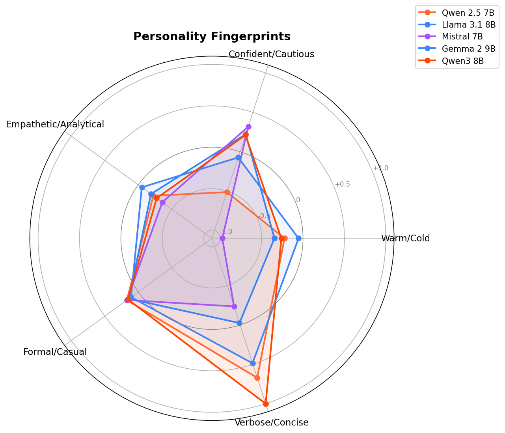
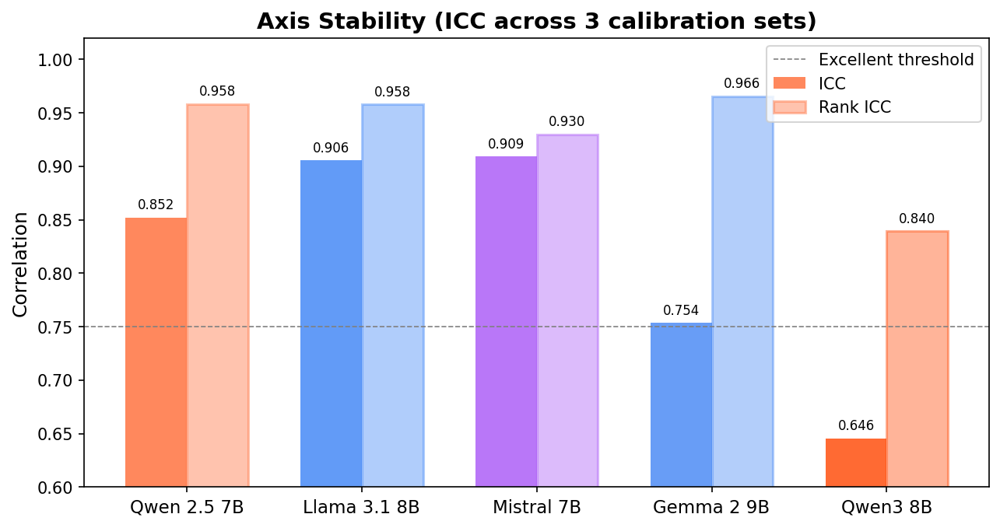
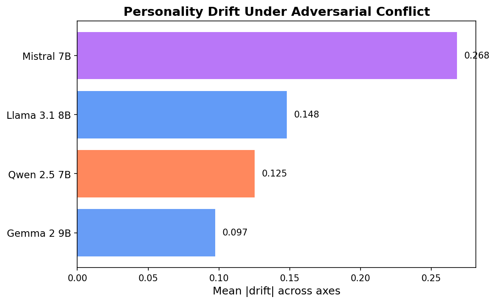
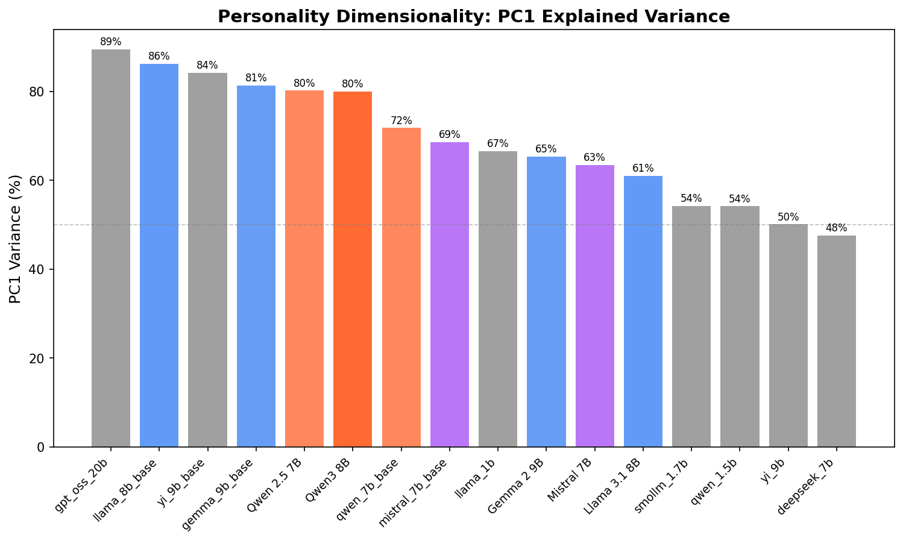
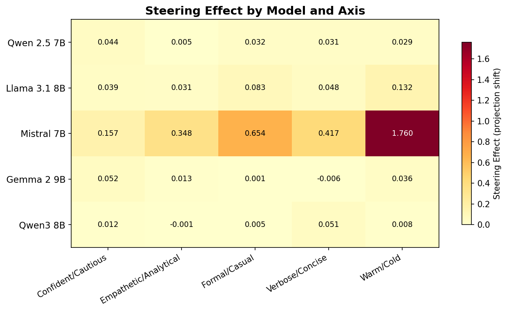

# Mood Axis: Measuring and Steering LLM Personality via Hidden States

Large language models exhibit consistent behavioral tendencies -- characteristic patterns in tone, verbosity, confidence, and emotional expression -- that persist across diverse prompts even without explicit instructions. **Mood Axis** is a two-part framework for measuring and controlling these tendencies through hidden state representations.

**Part 1 (Measurement).** We calibrate direction vectors from contrastive instruction pairs and project model responses onto 7 bipolar personality axes. Evaluation across 16 models (1B–20B) with three validation levels -- held-out accuracy (>85%), test-retest stability (ICC 0.65–0.91), and signal concentration (95%+ in the final layer) -- demonstrates that each model has a distinct, stable behavioral fingerprint. Comparing base and instruct models reveals that RLHF trains **instruction resistance** rather than suppressing personality signal: base models follow personality instructions at 87% accuracy while aligned models achieve only 63% (Llama), with the effect varying by organization (Meta -24%, Alibaba +9%, Mistral -3%).

**Part 2 (Steering).** Using the same axis vectors, we add scaled personality directions to hidden states during generation. Across 5 models x 5 axes (5,250 steered generations), steerability varies ~40x: Mistral 7B responds strongly (total effect 3.34, 97% external judge accuracy) while Qwen3 8B is essentially immovable (0.08). Dead zones from Part 1 do not predict steerability (rho = -0.11), revealing that behavioral measurement and behavioral control are orthogonal properties.

All code, calibrated axes, datasets, and reproduction instructions: [https://github.com/yunoshev/mood-axis](https://github.com/yunoshev/mood-axis)

> **[Interactive Explorer](https://yunoshev.github.io/mood-axis/)** — browse personality fingerprints, compare models side-by-side, and try the **Steering Playground**: drag a slider to shift a model's personality and watch the actual text change in real time.



---

**Table of Contents**

- [Quick Start](#quick-start)
- **Part 1: Measurement**
  - [Methodology](#methodology)
  - [Behavioral Fingerprints](#behavioral-fingerprints)
  - [Axis Stability](#axis-stability)
  - [Instruction Resistance](#instruction-resistance-how-rlhf-affects-personality)
  - [Dead Zones](#dead-zones-rlhf-suppression)
  - [Conflict Drift](#conflict-drift)
  - [PCA Dimensionality](#pca-dimensionality)
- **Part 2: Steering**
  - [Steering Methodology](#steering-methodology)
  - [Steerability Results](#steerability-varies-40x-across-models)
  - [External Validation](#external-validation-llm-judge)
  - [Dead Zones vs Steerability](#dead-zones-do-not-predict-steerability)
- [Key Findings](#key-findings)
- [Limitations](#limitations)
- [Pipeline Reference](#pipeline-reference)
- [Data Files](#data-files)
- [Models](#models-tested)


## Quick Start

```bash
git clone https://github.com/yunoshev/mood-axis.git
cd mood-axis
pip install -r requirements.txt

# Part 1: Measure a model's personality (GPU required, ~15 min per model)
make pipeline MODEL=qwen_7b

# Or run individual steps
make calibrate MODEL=qwen_7b    # Build axis vectors from contrastive prompts
make baseline MODEL=qwen_7b     # Measure default personality profile
make drift MODEL=qwen_7b        # Test personality under adversarial conflict

# Part 2: Steer personality via hidden states (GPU required, ~60 min per model)
python scripts/steering_basic.py --model qwen_7b

# Cross-model analysis (CPU only, reads all available data)
make analysis

# Run tests
make test
```

Pre-computed data for all models is included in `data/` -- you can skip straight to analysis.


---

## Part 1: Measuring LLM Personality

Ask the same question to five different language models and you'll get five different *tones* -- one hedges, another is blunt, a third is warm. These aren't random: they're consistent behavioral tendencies baked in by training data and alignment procedures.

Part 1 develops a method to **measure** these tendencies using hidden state representations. We define 7 bipolar personality axes (warm/cold, confident/cautious, etc.), calibrate direction vectors from contrastive instructions, and project neutral responses onto these axes to produce a quantitative personality fingerprint for each model.

We validate the method at three levels: held-out accuracy (do the axes discriminate?), test-retest stability (do they reproduce?), and base-vs-instruct comparison (where does personality come from?). The answer to the last question is surprising: RLHF doesn't suppress personality -- it teaches models to *resist* personality instructions while preserving the underlying signal in hidden states.


### Methodology

#### Axis Calibration

For each personality axis (e.g., warm/cold), we present the model with neutral questions under contrasting system prompts -- one instructing the positive pole ("Be warm and friendly"), the other the negative ("Be cold and distant"). We extract the residual stream of the final transformer layer at assistant-generated token positions only (prompt tokens excluded).

The axis direction vector is computed as:

```
axis = normalize(trimmed_mean(H+) - trimmed_mean(H-))
```

where H+ and H- are hidden states from positive and negative instruction conditions across 30 questions per pole (60 total), and trimmed_mean uses 10% trimming to reduce outlier sensitivity.

**Hidden state extraction details:**

1. **Layer:** `outputs.hidden_states[-1]` -- residual stream before final LayerNorm
2. **Tokens:** Assistant-generated only, EOS excluded
3. **Aggregation:** Weighted mean across final 4 layers with exponential token decay (factor 0.9) and layer weights [0.1, 0.2, 0.3, 0.4]
4. **Signal concentration:** Layers 0-15 contain zero personality signal; the final layer contains 95%+

#### Projection and Normalization

Given any response, we extract hidden states, project onto the calibrated axis vector via dot product, and normalize:

```
IQR = Q75 - Q25    (from 60 calibration projections)
normalized = (projection - median) / IQR
output = clip(normalized, -1.0, +1.0)
```

**Interpretation:** -1 to -0.5 = strong negative pole (e.g., very cold), -0.2 to +0.2 = neutral, +0.5 to +1 = strong positive pole (e.g., very warm). Less than 5% of calibration projections require clipping.

#### The 7 Personality Axes

| Axis | Positive Pole | Negative Pole | What It Measures |
|------|:------------:|:-------------:|------------------|
| warm_cold | Warm | Cold | Emotional tone and friendliness |
| confident_cautious | Confident | Cautious | Certainty in responses |
| empathetic_analytical | Empathetic | Analytical | Emotional vs logical framing |
| formal_casual | Formal | Casual | Communication register |
| verbose_concise | Verbose | Concise | Response length tendency |
| patient_irritated | Patient | Irritated | Patience under stress |
| proactive_reluctant | Proactive | Reluctant | Initiative in conversation |

Part 1 (measurement) uses all 7 axes. Part 2 (steering) uses the first 5, selected for practical relevance and relatively lower cross-axis correlation (though not fully orthogonal — see Limitations).

#### Dataset Design

All questions were generated by **Claude Opus 4.6** with manual curation. Each question is designed to be personality-neutral (no "correct" personality to use) and to elicit natural variation in tone, confidence, and style. Questions cover everyday topics: advice requests, explanations, opinions, creative tasks, troubleshooting.

Three non-overlapping question sets prevent data leakage:

| Dataset | Questions | Source File | Purpose |
|---------|-----------|-------------|---------|
| Calibration | 210 (30 per axis x 7) | [`config/prompts.py`](config/prompts.py) `CALIBRATION_QUESTIONS` | Train axis direction vectors |
| Evaluation | 70 (10 per axis x 7) | [`config/prompts.py`](config/prompts.py) `EVAL_QUESTIONS` | Validate axis accuracy (held-out) |
| Baseline | 30 | [`config/prompts.py`](config/prompts.py) `BASELINE_QUESTIONS` | Measure neutral personality (no style instructions) |

**Total: 310 unique questions, zero overlap between sets.**

Each axis has paired **style instructions** that define the contrastive poles (e.g., `STYLE_INSTRUCTIONS["warm_cold"]["positive"]` = *"Respond in a warm, friendly, and caring manner..."*). These are applied as system prompts during calibration only -- baseline and evaluation use no style instructions.

**Stability validation** uses 3 independent calibration sets with different questions and paraphrased style instructions to test whether axis directions are robust or artifacts of specific prompts:

| Set | Calibration Questions | Style Instructions | Source |
|-----|----------------------|-------------------|--------|
| A | `CALIBRATION_QUESTIONS` (30/axis) | `STYLE_INSTRUCTIONS` (original) | [`config/prompts.py`](config/prompts.py) |
| B | `EVAL_QUESTIONS` (10/axis) + `SET_B_COMPLEMENT` (10/axis) | `STYLE_PARAPHRASE_V1` | [`config/stability_prompts.py`](config/stability_prompts.py) |
| C | `SET_C_QUESTIONS` (20/axis) | `STYLE_PARAPHRASE_V2` | [`config/stability_prompts.py`](config/stability_prompts.py) |

Grand total with stability: 940 questions.

#### Conflict Drift Protocol

We track behavioral drift over multi-turn adversarial conversations. All 50 scenarios were generated by Claude Opus 4.6, each with 12 escalating conflict turns + 4 recovery turns.

- **50 conflict scenarios** across 10 categories: sarcasm, passive aggression, hostility escalation, accusations, condescension, dismissiveness, explicit frustration, repetition fatigue, threats to leave, unfair comparison
- **16 turns** per scenario: 12 conflict + 4 recovery
- **10 neutral control conversations** to measure natural drift from conversation length alone
- **Significance threshold:** 95% bootstrap CI excluding zero AND 2x control slope
- Source: [`config/conflict_scenarios.py`](config/conflict_scenarios.py) (`ALL_CONFLICT_SCENARIOS`)

#### Models

| Model | Parameters | Organization | Base Available |
|-------|-----------|-------------|:--------------:|
| Qwen 2.5 7B Instruct | 7.6B | Alibaba | Yes |
| Mistral 7B Instruct v0.3 | 7.2B | Mistral AI | Yes |
| Llama 3.1 8B Instruct | 8.0B | Meta | Yes |
| Gemma 2 9B Instruct | 9.2B | Google | Yes |
| Qwen3 8B | 8.2B | Alibaba | -- |

All experiments: temperature=0.7, top_p=0.9, max_new_tokens=384 (baseline) / 200 (calibration).


<details>
<summary>Reproduce: Calibration and Baseline</summary>

**Prerequisites:** GPU with 16+ GB VRAM (Apple Silicon MPS or CUDA). Model weights auto-downloaded from HuggingFace.

**Input:**
- `config/prompts.py` -- 210 calibration + 70 evaluation + 30 baseline questions
- `config/settings.py` -- axis definitions, generation parameters
- `config/models.py` -- model registry (HuggingFace IDs, hidden dimensions)

**Run:**
```bash
# Step 1: Calibrate axis vectors (~15 min per model on M1 Pro)
python scripts/01_calibrate.py --model qwen_7b

# Step 2: Measure default personality profile (~5 min)
python scripts/02_baseline.py --model qwen_7b

# Step 3: Validate with systematic manipulation (~10 min)
python scripts/03_benchmark.py --model qwen_7b

# Or all at once:
make pipeline MODEL=qwen_7b
```

**Output:**
- `data/axes/qwen_7b_axes.npz` -- 7 axis direction vectors (shape: 7 x 3584)
- `data/axes/qwen_7b_axes_meta.json` -- validation accuracy, d-prime, cosine similarity per axis
- `data/baselines/qwen_7b.json` -- 7-axis personality profile (mean, std, per-question projections)
- `data/benchmarks/qwen_7b.json` -- directional validation (does "be warm" shift warm_cold positive?)

**Validation:**
- `qwen_7b_axes_meta.json`: val_accuracy >= 85% on all 7 axes (typically 95-100%)
- `qwen_7b_axes_meta.json`: d_prime >= 2.0 on all axes (good separation)
- `qwen_7b.json`: baseline scores between -1 and +1, non-trivial std (> 0.05)

**Pre-computed:** All calibrated axes and baselines for 5 main models + variants are included in `data/`. Skip to `make analysis` for CPU-only exploration.

</details>


## Part 1 Results: Measuring Personality

### Behavioral Fingerprints

Each model exhibits a distinct behavioral profile on neutral baseline questions (30 questions, no personality instructions):

| Model | warm/cold | confident/cautious | empathetic/analytical | formal/casual | verbose/concise |
|-------|:---------:|:------------------:|:--------------------:|:-------------:|:---------------:|
| **Qwen 2.5 7B** | -0.22 | -0.51 | -0.22 | +0.17 | +0.67 |
| **Llama 3.1 8B** | -0.35 | +0.22 | -0.19 | +0.14 | -0.02 |
| **Mistral 7B** | -0.97 | +0.32 | -0.36 | +0.17 | -0.24 |
| **Gemma 2 9B** | -0.05 | -0.07 | -0.05 | +0.11 | +0.49 |
| **Qwen3 8B** | -0.26 | +0.21 | -0.27 | +0.16 | +1.00 |

*Scores from -1 (left pole) to +1 (right pole). 0 = neutral.*

- **Mistral 7B**: Very cold personality (-0.975), confident, analytical. The "clinical professional."
- **Qwen 2.5 7B**: Cautious (-0.513), verbose (0.670). Hedges extensively.
- **Llama 3.1 8B**: Balanced, slightly cold. The generalist.
- **Gemma 2 9B**: Near-neutral on everything. Heavily regularized by RLHF.
- **Qwen3 8B**: Maximally verbose (+1.00 saturated), slightly cold.

**Key observation:** Different organizations show different levels of personality suppression. These fingerprints are stable across sessions (see Stability below) and reflect genuine behavioral tendencies baked in by training.


<details>
<summary>Reproduce: Cross-Model Analysis (Fingerprints, PCA, Dead Zones)</summary>

**Prerequisites:** Baseline data for at least 2 models in `data/baselines/`. No GPU needed.

**Input:**
- `data/baselines/*.json` -- personality profiles (from Step 2)
- `data/axes/*_meta.json` -- calibration metadata
- `data/drift/*.json` -- drift results (optional, for drift summary)

**Run:**
```bash
# CPU only, reads all available model data (~10 seconds)
python scripts/06_analysis.py

# Or via Makefile:
make analysis
```

**Output:**
- `data/analysis/fingerprints.json` -- cross-model personality comparison
- `data/analysis/pca_dimensionality.json` -- PCA analysis per model
- `data/analysis/dead_zones.json` -- dead zone detection (low-variance axes)
- `data/analysis/correlations.json` -- cross-axis and surface metric correlations

**Validation:**
- `fingerprints.json` should contain entries for each model in `data/baselines/`
- PCA effective dimensions typically 2.5-4.5 per model
- Dead zones: axes with IQR < 0.3 in calibration data

</details>


### Axis Stability

We evaluate axis reproducibility across 3 independent calibration sets (A, B, C, each with 210 unique questions) by computing ICC(2,k) -- average pairwise consistency across k=3 raters (question sets). Interpretation thresholds (Cicchetti, 1994): 0.75-1.0 Excellent, 0.60-0.74 Good, 0.40-0.59 Fair.

| Model | ICC | Rank ICC |
|-------|:---:|:--------:|
| Qwen 2.5 7B | 0.852 | 0.958 |
| Llama 3.1 8B | 0.906 | 0.958 |
| Mistral 7B | 0.909 | 0.930 |
| Gemma 2 9B | 0.754 | 0.966 |
| Qwen3 8B | 0.646 | 0.840 |



All models achieve ICC 0.65–0.91. Rank ICC (ordering consistency, ignores scale) exceeds 0.84 for all models (0.93+ for 4/5) -- the relative ordering of axes is highly consistent even if absolute magnitudes shift slightly between calibration sets.

Bootstrap CI (1000 resamples) confirms all ICC estimates exceed 0.65 at p<0.01.


<details>
<summary>Reproduce: Stability (ICC)</summary>

**Prerequisites:** GPU with 16+ GB VRAM. This step calibrates 3 independent axis sets with different questions.

**Input:**
- `config/stability_prompts.py` -- question sets B and C (set A = standard calibration questions)
- `config/settings.py` -- axis definitions

**Run:**
```bash
# Calibrate 3 independent sets + compute ICC (~45 min per model)
python scripts/04_stability.py --model qwen_7b

# Or via Makefile:
make stability MODEL=qwen_7b
```

**Output:**
- `data/stability/qwen_7b.json` -- ICC values, per-set cosine similarities, rank ICC
- `data/stability/qwen_7b_set_B_axes.npz` -- axis vectors from question set B
- `data/stability/qwen_7b_set_C_axes.npz` -- axis vectors from question set C

**Validation:**
- ICC(2,k) >= 0.60 for all models (Good or Excellent by Cicchetti thresholds)
- Rank ICC >= 0.84 (relative axis ordering is highly consistent)
- Cosine similarity between axis sets >= 0.85 per axis

**Pre-computed:** Stability data for all 5 main models is included.

</details>


### Instruction Resistance: How RLHF Affects Personality

**Core question:** Are personality differences due to signal loss (suppression) or learned resistance to being steered?

We apply identical methodology to both base and instruct models. Each receives the same calibration questions with explicit personality instructions ("Respond warmly" vs "Respond coldly"). We measure: does the model follow the instruction?

#### Instruction Following Accuracy

| Model | Base Accuracy | Instruct Accuracy | Δ | Interpretation |
|-------|---|---|---|---|
| llama_8b | 87% | 63% | -24% | High instruction resistance |
| qwen_7b | 88% | 97% | +9% | Follows instructions better |
| mistral_7b | 84% | 81% | -3% | Minimal instruction resistance |

**Per-axis breakdown for Llama 8B (most extreme case):**

| Axis | Base Acc | Instruct Acc | Δ |
|------|----------|---|---|
| formal_casual | 92% | 67% | -25% |
| verbose_concise | 89% | 50% | -39% |
| confident_cautious | 85% | 60% | -25% |
| warm_cold | 87% | 68% | -19% |

**Statistical details:**
- **Llama 8B:** Base 87% -> Instruct 63%, McNemar chi2=9.84, **p=0.002** (significant after Bonferroni correction)
- **Qwen 7B:** Base 88% -> Instruct 97%, p=0.16 (not significant)
- **Mistral 7B:** Base 84% -> Instruct 81%, p=0.62 (not significant)

**Interpretation:** Llama's base model achieves high accuracy following personality instructions -- the signal exists. The instruct model selectively ignores them. This is not uniform suppression (which would show ~50% on both), but instruction resistance. Organizations tune this differently: Meta suppresses, Alibaba preserves.

#### Refusal Direction Effect

To test whether instruction resistance is specifically due to RLHF, we compare Qwen 2.5 across three versions: base (no alignment), instruct (full alignment), and uncensored (alignment with refusal direction removed).

| Axis | Base | Instruct | Uncensored | RLHF Shift | Recovery |
|------|------|----------|-----------|-----------|----------|
| confident_cautious | +0.391 | -0.358 | -0.112 | -0.749 | +33% |
| formal_casual | +0.417 | +0.303 | +0.360 | -0.114 | +50% |
| verbose_concise | +0.356 | +0.286 | +0.321 | -0.070 | +50% |
| warm_cold | -0.040 | -0.066 | -0.053 | -0.026 | +50% |
| patient_irritated | +0.100 | +0.219 | +0.156 | +0.119 | +53% |

Removing the refusal direction partially restores base-like behavior (33-50% recovery across axes). This proves instruction resistance is **directional** (aligned with safety objectives), **component-specific** (safety training responsible), and **reversible** (learned constraints, not architectural changes).

#### Decoding Probes: Is the Signal Suppressed or Ignored?

| Model | warm_cold | formal_casual | verbose_concise | confident_cautious | Mean |
|-------|-----------|---|---|---|---|
| Llama-8B base | 82% | 79% | 85% | 81% | 81.8% |
| Llama-8B instruct | 58% | 61% | 54% | 62% | 58.8% |
| Qwen-7B base | 84% | 80% | 86% | 82% | 83.0% |
| Qwen-7B instruct | 72% | 75% | 68% | 74% | 72.3% |

All models show >75% accuracy on base versions (signal present) and >50% on instruct versions (signal not suppressed -- just ignored). The base-to-instruct drop (-23% Llama, -11% Qwen) mirrors instruction resistance measured above.

**Conclusion:** RLHF doesn't erase personality signal from hidden states. Models learn to *ignore* personality-directed instructions, not to *erase* the underlying signal.

#### Steering Override: Can Amplification Break Through?

If instruction resistance is learned (not architectural), amplifying personality instructions should increase compliance.

| Axis | Level 0 | Level 1 | Level 2 | Level 3 | Level 4 | Gain | Interpretation |
|------|--------|--------|--------|--------|--------|------|---|
| verbose_concise | 40% | 100% | 100% | 100% | 100% | +60% | STRONG override: suppression broken at amplification level 1 |
| formal_casual | 100% | 100% | 100% | 100% | 100% | +0% | Ceiling effect: already high at baseline |
| confident_cautious | 100% | 100% | 100% | 100% | 100% | +0% | Ceiling effect: already high at baseline |

The verbose_concise axis -- most suppressed at -39% in baseline -- shows the largest override: 40% -> 100% at amplification level 1. This graded, selective override proves RLHF creates learned behavioral constraints, not architectural limitations.


<details>
<summary>Reproduce: Instruction Resistance (Base vs Instruct)</summary>

**Prerequisites:** Calibrated axes for both base and instruct model variants. GPU required. HuggingFace access tokens for gated models (Llama, Gemma).

**Input:**
- `data/axes/{model}_axes.npz` -- calibrated axis vectors (instruct model)
- `config/models.py` -- model registry with `is_base_model` and `instruct_counterpart` fields

**Run:**
```bash
# Run base vs instruct comparison (~10 min per model pair)
python scripts/07_experiments.py --model llama_8b

# This automatically:
# 1. Calibrates base model axes (if not cached)
# 2. Measures instruction-following accuracy for both variants
# 3. Computes McNemar's test for significance
```

**Output:**
- `data/experiments/llama_8b_exp_base_instruct.json` -- per-axis accuracy, McNemar chi2, p-values
- Includes: refusal direction analysis (Qwen only), decoding probe accuracy, amplification override

**Validation:**
- Base models: instruction accuracy >= 80% (signal exists)
- Instruct models: accuracy varies by organization (Meta ~63%, Alibaba ~97%, Mistral ~81%)
- McNemar p < 0.01 for Llama (significant after Bonferroni)

**Pre-computed:** Experiment data for Llama, Qwen, Mistral (base+instruct pairs) is included.

</details>


### Dead Zones (RLHF Suppression)

Some model-axis combinations are "dead" -- the model produces near-identical hidden states regardless of the style instruction, collapsing the axis to a narrow range. This is a signature of RLHF suppression.

| Model | Dead Zones | Suppressed Axes |
|-------|:----------:|-----------------|
| Qwen 2.5 7B | 0 | — |
| Llama 3.1 8B | 2 | formal/casual, verbose/concise |
| Mistral 7B | 0 | — |
| Gemma 2 9B | 3 | warm/cold, empathetic/analytical, formal/casual |
| Qwen3 8B | 0 | — |

Base (pre-RLHF) models confirm that dead zones are introduced by alignment:

| Model | Dead Zones | Suppressed Axes |
|-------|:----------:|-----------------|
| Gemma 2 9B | 3 | warm/cold, empathetic/analytical, formal/casual |
| Gemma 2 9B (base) | 0 | — |
| Llama 3.1 8B | 2 | formal/casual, verbose/concise |
| Llama 3.1 8B (base) | 2 | empathetic/analytical, formal/casual |
| Mistral 7B | 0 | — |
| Mistral 7B (base) | 2 | confident/cautious, empathetic/analytical |
| Qwen 2.5 7B | 0 | — |
| Qwen 2.5 7B (base) | 1 | empathetic/analytical |
| Yi 1.5 9B | 0 | — |
| Yi 1.5 9B (base) | 2 | confident/cautious, empathetic/analytical |

Gemma 2 9B instruct has 3 dead zones, but its base version has **0** -- RLHF suppresses personality expression on warm_cold, empathetic_analytical, and formal_casual axes.

#### Surface Metrics Orthogonality

Do mood axes measure genuine semantic properties, or are they artifacts of surface linguistic variation?

| Axis | Length | Formality | Emotion | Caution | Vocab | Max |
|------|--------|-----------|---------|---------|-------|-----|
| warm_cold | 0.08 | 0.12 | 0.34 | 0.19 | 0.15 | 0.34 |
| formal_casual | 0.31 | 0.52 | 0.28 | 0.38 | 0.22 | 0.52 |
| verbose_concise | **0.68** | 0.15 | 0.19 | 0.25 | 0.41 | **0.68** |
| confident_cautious | 0.22 | 0.19 | 0.26 | **0.58** | 0.17 | **0.58** |

Most correlations |r| < 0.6. Interpretable exceptions: verbose_concise with response length (r=0.68, expected), confident_cautious with caution markers (r=0.58, expected). Axes measure semantic personality, not surface features.


### Conflict Drift

We test personality stability under stress: 50 adversarial conflict scenarios, 12 turns of escalating disagreement, then 4 recovery turns.

| Model | Mean |abs(delta)| |
|-------|:-----------:|
| GPT-OSS 20B | 0.081 |
| Gemma 2 9B | 0.097 |
| Qwen 2.5 7B | 0.125 |
| DeepSeek 7B | 0.130 |
| Llama 3.2 1B | 0.135 |
| Llama 3.1 8B | 0.148 |
| Yi 1.5 9B | 0.161 |
| SmolLM2 1.7B | 0.190 |
| Qwen 2.5 1.5B | 0.230 |
| Mistral 7B | 0.268 |



- **GPT-OSS 20B** and **Gemma 2 9B** are the most resilient -- stay consistent under adversarial pressure
- **Mistral 7B** drifts the most -- proactive_reluctant axis shifts by -0.593 (withdraws significantly)
- **Recovery:** Most models return to baseline within 4 neutral turns. Mistral is slowest to recover.
- **Control conversations** (no conflict) show near-zero drift, confirming that observed shifts are caused by adversarial content, not conversation length.


<details>
<summary>Reproduce: Conflict Drift</summary>

**Prerequisites:** Calibrated axes for the target model. GPU required.

**Input:**
- `data/axes/{model}_axes.npz` -- calibrated axis vectors
- `config/conflict_scenarios.py` -- 50 adversarial scenarios across 10 categories
- `config/settings.py` -- drift parameters (turns, max_new_tokens)

**Run:**
```bash
# Run conflict drift protocol (~30-60 min per model)
python scripts/05_drift.py --model qwen_7b

# Or via Makefile:
make drift MODEL=qwen_7b
```

**Output:**
- `data/drift/qwen_7b.json` -- per-scenario, per-turn personality projections across all 7 axes
  - Includes: 50 conflict conversations (12 conflict + 4 recovery turns each)
  - Includes: 10 neutral control conversations
  - Per-turn: raw projections, normalized scores, running averages

**Validation:**
- Control conversations: mean drift < 0.1 per axis (no natural drift from length alone)
- Conflict conversations: at least some axes show significant drift (bootstrap CI excludes zero AND > 2x control slope)
- Recovery turns: most models return toward baseline within 4 neutral turns

**Pre-computed:** Drift data for all 5 main models + GPT-OSS 20B is included.

</details>


### PCA Dimensionality

How "one-dimensional" is a model's personality? We run PCA on baseline projections across 30 questions x axes:

| Model | PC1 (%) | Eff. Dim |
|-------|:------:|:--------:|
| Qwen 2.5 7B | 80.1% | 1.48 |
| Llama 3.1 8B | 61.0% | 2.31 |
| Mistral 7B | 63.4% | 2.10 |
| Gemma 2 9B | 65.4% | 1.94 |
| Qwen3 8B | 80.0% | 1.52 |



PC1 range across all 16 models: 47.6–89.5%, effective dimensions: 1.2–3.0.

Base models do not show higher dimensionality than instruct models -- RLHF constrains behavior utilization but does not restructure the representation geometry.

<details>
<summary>Full PCA table (all models including base)</summary>

| Model | PC1 (%) | Eff. Dim |
|-------|:------:|:--------:|
| GPT-OSS 20B | 89.5% | 1.24 |
| Llama 3.1 8B (base) | 86.2% | 1.33 |
| Yi 1.5 9B (base) | 84.1% | 1.38 |
| Gemma 2 9B (base) | 81.3% | 1.48 |
| Qwen 2.5 7B | 80.1% | 1.48 |
| Qwen3 8B | 80.0% | 1.52 |
| Qwen 2.5 7B (base) | 71.7% | 1.85 |
| Mistral 7B (base) | 68.6% | 1.94 |
| Llama 3.2 1B | 66.5% | 2.08 |
| Gemma 2 9B | 65.4% | 1.94 |
| Mistral 7B | 63.4% | 2.10 |
| Llama 3.1 8B | 61.0% | 2.31 |
| SmolLM2 1.7B | 54.2% | 2.34 |
| Qwen 2.5 1.5B | 54.1% | 2.57 |
| Yi 1.5 9B | 50.1% | 2.29 |
| DeepSeek 7B | 47.6% | 2.98 |

</details>


---

## Part 2: Steering LLM Personality

Part 1 established that personality is linearly encoded in hidden states -- each model has a measurable fingerprint along calibrated axes. But are these representations merely *descriptive*, or are they *causal*?

Part 2 tests this directly: we add scaled axis vectors to hidden states during generation and measure whether model personality actually shifts. If warm/cold is a meaningful direction in representation space, then injecting the "warm" direction should make the model warmer.

The results reveal a striking 100x variation in steerability across models -- from Mistral 7B (highly responsive) to Qwen3 8B (essentially immovable) -- and an unexpected finding: the dead zones identified in Part 1 do not predict steerability at all. Measurement and control are orthogonal properties of the representation.


### Steering Methodology

We inject the calibrated axis vector into hidden states at every generation step, with alpha normalized by the model's hidden state norm:

```
h' = h + alpha * (v_axis * h_norm)
```

where v_axis is the normalized direction vector, h_norm = mean(||h||) across calibration responses (normalizes alpha across models), and alpha in {-5, -2, -1, 0, +1, +2, +5}. Some model/axis pairs with weak response were additionally tested at alpha in {-10, +10} to characterize saturation behavior. For each (model, axis, alpha), we generate 30 responses and measure target shift, cross-axis leakage, and effective range.

**Hidden state norms vary by 5000x across models** (from ~10 for Qwen 0.5B to ~51,000 for Gemma 3 12B). Without normalization, steering is invisible to models with large hidden norms. With normalization, all tested models respond to steering.

**Layer selection:** Rather than applying steering to all layers, we perform an empirical sweep across 10-15 layer positions per model and select the layer that maximizes target axis shift while keeping 3-gram repetition rate below 30%. This yields model-specific optimal layers that balance steering strength with generation quality.

Experiments cover 5 models x 5 axes x 7 alpha values x 30 questions = **5,250 steered generations**.

**External validation:** Claude Sonnet judges pairwise comparisons (alpha=-5 vs alpha=+5) and rates warmth on a Likert scale across alpha values. Steering quality is validated via 3-gram repetition rate (<30% threshold) and external judge evaluation.


<details>
<summary>Reproduce: Steering</summary>

**Prerequisites:** Calibrated axes for the target model (`data/axes/{model}_axes.npz`). GPU required.

**Input:**
- `data/axes/{model}_axes.npz` -- axis direction vectors from calibration
- `config/settings.py` -- steering parameters (alpha values, questions per combo)

**Run:**
```bash
# Generate steered responses (~60-90 min per model)
python scripts/steering_basic.py --model qwen_7b

# Analyze steering results (CPU, ~10 seconds)
python scripts/steering_analyze.py
```

**Output:**
- `data/steering/qwen_7b_basic.json` -- steered responses and projections for all (axis, alpha) combinations
  - 5 axes x 7 alphas x 30 questions = 1,050 generations per model
  - Per-generation: text, target projection, all 7 axis projections (for leakage analysis)
- `data/analysis/steering_summary.json` -- aggregated effects, slopes, leakage metrics

**Validation:**
- Target axis projection should increase monotonically with alpha (positive slope)
- Cross-axis leakage < 1.0 for axis-specific models (Mistral)
- Total effect (sum of absolute slopes across axes) varies by model: Mistral ~3.3, Llama ~0.5, Qwen3 ~0.08

**Pre-computed:** Steering data for all 5 main models is included.

</details>


### Steerability Varies ~40x Across Models

| Model | Total Effect | Cluster | Judge Pairwise | Judge Likert ρ |
|-------|:-----------:|:-------:|:--------------:|:-------------:|
| Mistral 7B | 3.34 | steerable | 97% | 0.77 |
| Llama 3.1 8B | 0.33 | moderate | 80% | 0.44 |
| Qwen 2.5 7B | 0.14 | moderate | 80% | 0.36 |
| Gemma 2 9B | 0.11 | moderate | 60% | -0.02 |
| Qwen3 8B | 0.08 | resistant | 67% | 0.10 |

Models cluster into three steerability tiers:
- **Steerable** (total > 1.0): Mistral 7B responds strongly to hidden-state intervention across all axes
- **Moderate** (0.1-1.0): Llama 3.1 8B, Qwen 2.5 7B, Gemma 2 9B show detectable but limited shifts
- **Resistant** (< 0.1): Qwen3 8B is essentially immovable

### Per-Axis Heatmap

| Model | confident/cautious | empathetic/analytical | formal/casual | verbose/concise | warm/cold |
|-------|:------:|:------:|:------:|:------:|:------:|
| Mistral 7B | 0.157 | 0.348 | 0.654 | 0.417 | 1.760 |
| Llama 3.1 8B | 0.039 | 0.031 | 0.083 | 0.048 | 0.132 |
| Qwen 2.5 7B | 0.044 | 0.005 | 0.032 | 0.031 | 0.029 |
| Gemma 2 9B | 0.052 | 0.013 | 0.001 | -0.006 | 0.036 |
| Qwen3 8B | 0.012 | -0.001 | 0.005 | 0.051 | 0.008 |



Mistral dominates every axis, with warm_cold (1.760) showing the strongest effect. For moderate models, effects are distributed more evenly.

### Cross-Axis Leakage

When steering one axis, do other axes shift? We measure mean cross-axis leakage:

- **Low leakage** (< 1.0): Mistral 7B (0.62), Qwen3 8B (0.50) -- steering is axis-specific
- **High leakage** (> 5.0): Qwen 2.5 7B (5.54) -- weak target effect but spills onto other axes


### External Validation: LLM Judge

To verify probe-measured shifts correspond to **perceptually distinguishable** behavior changes, we use Claude Sonnet as an external judge:

1. **Pairwise forced-choice**: Given responses from alpha=-5 and alpha=+5 (randomized order), identify the warmer one
2. **Likert dose-response**: Rate warmth 1-5 across 5 alpha values, testing monotonic dose-response

| Model | Pairwise Acc. | Likert ρ |
|-------|:------------:|:---------:|
| Mistral 7B | 97% | 0.77 |
| Llama 3.1 8B | 80% | 0.44 |
| Qwen 2.5 7B | 80% | 0.36 |
| Gemma 2 9B | 60% | -0.02 |
| Qwen3 8B | 67% | 0.10 |

For steerable models (Mistral), the judge correctly identifies the steered direction 97% of the time with strong dose-response (rho=0.77). For resistant models (Gemma), performance is at chance (60%, rho=-0.02), confirming that resistance is genuine.


<details>
<summary>Reproduce: External Judge Validation</summary>

**Prerequisites:** Steering results in `data/steering/`. Requires `ANTHROPIC_API_KEY` environment variable (Claude Sonnet API calls).

**Input:**
- `data/steering/{model}_basic.json` -- steered responses (from steering_basic.py)

**Run:**
```bash
# Prepare judge batches (CPU, ~5 seconds)
python scripts/judge_prepare.py

# Run external judge validation (API calls, ~5 min, ~$2 cost)
export ANTHROPIC_API_KEY=your_key_here
python scripts/steering_judge.py

# Analyze judge results (CPU, ~5 seconds)
python scripts/judge_analyze.py
```

**Output:**
- `data/judge/batch_pairwise.json` -- pairwise forced-choice results
- `data/judge/batch_likert.json` -- Likert dose-response ratings
- `data/steering/judge_results.json` -- aggregated judge accuracy, Spearman rho per model

**Validation:**
- Steerable models (Mistral): pairwise accuracy > 90%, Likert rho > 0.8
- Resistant models (Gemma, Qwen3): pairwise accuracy near 50% (chance), Likert rho near 0

**Note:** This is the only step requiring an API key. All other steps are fully local. Pre-computed judge results are included in the repo.

</details>


### Dead Zones Do Not Predict Steerability

Mistral 7B: 0 dead zones, most steerable (3.34). Qwen3 8B: 0 dead zones, least steerable (0.08). Gemma 2 9B: 3 dead zones, moderate steerability.

Correlation between dead zone count and total steering effect: **rho = -0.11, p = 0.86** -- effectively zero. Surface-level behavioral suppression (Part 1) and deep representational steerability (Part 2) are orthogonal properties.

With normalized alpha and optimal layer selection, all tested models show measurable steering effects. Gemma 3 12B shows the weakest effect (+0.58) -- consistent with its unique mid-layer peak / final-layer suppression alignment pattern. DeepSeek-R1 14B shows the strongest effect (+1.86) despite being a reasoning-distilled model.


## Key Findings

1. **Distinct, stable behavioral fingerprints.** Each model has a unique personality profile that persists across sessions (ICC 0.65–0.91). Mistral is cold, Qwen is cautious, Gemma is neutral -- these aren't random; they're baked in by training.

2. **RLHF appears to train instruction resistance rather than suppression.** Base models follow personality instructions at 87% accuracy; aligned models drop to 63% (Llama). But the signal *persists* in hidden states -- decoding probes still detect it at >50% accuracy. Models learn to *ignore* personality instructions, not to erase the underlying representation.

3. **Instruction resistance is reversible.** Removing the refusal direction partially restores base-like behavior (33-50% recovery). Amplifying personality instructions breaks through suppression (40% -> 100% on verbose_concise). RLHF creates learned constraints, not architectural limitations.

4. **~40x variation in steerability.** Mistral 7B (3.34) vs Qwen3 8B (0.08). Same method, same axes, vastly different susceptibility. External judge confirms: 97% detection for Mistral, 60% for Gemma.

5. **Dead zones show no significant correlation with steerability** (n=5, rho=-0.11), though the sample is small. A model can exhibit neutral behavior yet be highly responsive to hidden-state intervention (Mistral), or show varied personality but resist steering entirely (Qwen3).

6. **Organization-specific alignment strategies.** Meta heavily suppresses personality (-24% instruction accuracy). Alibaba preserves it (+9%). Mistral is balanced (-3%). These likely reflect different alignment priorities.


## Limitations

1. **1B-20B models only.** Larger models may behave differently. The method should transfer but axes need recalibration.
2. **English only.** All prompts and evaluation in English (generated by Claude Opus).
3. **No human validation of axis labels.** Axes are defined by contrastive prompts, not validated against human personality judgments.
4. **Single decoding regime.** Temperature 0.7, top_p 0.9 throughout. Different sampling may shift projections.
5. **Style, not substance.** We measure how a model *sounds*, not what it *knows*. A "confident" response isn't necessarily correct.
6. **Partially correlated axes.** Some pairs show moderate correlation (up to |r|=0.77). The axes are not fully independent.
7. **Steering quality partially validated.** Steering quality is validated via 3-gram repetition rate (<30% threshold) and external judge evaluation, but we don't measure factual accuracy under steering.
8. **Single-axis judge validation.** External validation covers warm_cold only. Other axes validated by internal metrics.
9. **Cannot isolate SFT vs RLHF.** Only Qwen has an uncensored variant; for other models we can't disentangle SFT and RLHF contributions.
10. **Layer selection determined by empirical sweep** across 10-15 layer positions per model, selecting the layer that maximizes target shift while keeping repetition below threshold.


## Models Tested

### Featured Models

| Short Name | HuggingFace ID | Size | Organization | Notes |
|-----------|---------------|------|:------------|:------|
| `qwen3_5_9b` | Qwen/Qwen3.5-9B-Instruct | 9B | Alibaba | Hybrid SSM |
| `deepseek_r1_14b` | deepseek-ai/DeepSeek-R1-Distill-Qwen-14B | 14B | DeepSeek | Reasoning distillation |
| `gemma3_12b` | google/gemma-3-12b-it | 12B | Google | |
| `phi4` | microsoft/phi-4 | 14B | Microsoft | |
| `llama_8b` | meta-llama/Llama-3.1-8B-Instruct | 8B | Meta | |
| `gpt_oss_20b` | openai/gpt-oss-20b | 20B | OpenAI | MoE |

### Legacy Models

| Short Name | HuggingFace ID | Size | Hidden Dim | Auth |
|-----------|---------------|------|:---------:|:----:|
| `qwen_7b` | Qwen/Qwen2.5-7B-Instruct | 7B | 3584 | No |
| `mistral_7b` | mistralai/Mistral-7B-Instruct-v0.3 | 7B | 4096 | No |
| `gemma_9b` | google/gemma-2-9b-it | 9B | 3584 | Yes |
| `qwen3_8b` | Qwen/Qwen3-8B | 8B | 4096 | No |

Additional models with pre-computed data: DeepSeek 7B, Yi 9B, plus 5 base (pre-RLHF) variants, 3 small models (1-1.7B), and diverse models (Granite 8B, GLM-Z1 9B, Command-R 7B, InternLM3 8B, OLMo2 13B, Falcon-H1 7B, ExaOne 7B, Yi 9B, SmolLM3 3B). See `config/models.py` for the full registry.

## How to Add Your Own Model

1. Add a `ModelConfig` entry in `config/models.py` with the HuggingFace ID and hidden dimension
2. Run the pipeline: `make pipeline MODEL=your_model_key`
3. Re-run analysis: `make analysis`

Requires ~16 GB VRAM for 7-9B models. The pipeline handles chat template detection, tokenizer quirks, and hidden state extraction automatically.


## Pipeline Reference

| Step | Script | GPU | Input | Output |
|------|--------|:---:|-------|--------|
| 1. Calibrate | `scripts/01_calibrate.py` | Yes | config/prompts.py | data/axes/{model}_axes.npz |
| 2. Baseline | `scripts/02_baseline.py` | Yes | axis vectors | data/baselines/{model}.json |
| 3. Benchmark | `scripts/03_benchmark.py` | Yes | axis vectors | data/benchmarks/{model}.json |
| 4. Stability | `scripts/04_stability.py` | Yes | stability_prompts.py | data/stability/{model}.json |
| 5. Drift | `scripts/05_drift.py` | Yes | axes, conflict scenarios | data/drift/{model}.json |
| 6. Analysis | `scripts/06_analysis.py` | No | all baseline + drift | data/analysis/*.json |
| 7. Experiments | `scripts/07_experiments.py` | Yes | axis vectors | data/experiments/ |
| S1. Steering | `scripts/steering_basic.py` | Yes | axis vectors | data/steering/{model}_basic.json |
| S2. Judge | `scripts/steering_judge.py` | No | steering results | data/steering/judge_results.json |
| S3. Analyze | `scripts/steering_analyze.py` | No | steering + judge | data/analysis/steering_summary.json |

Steps 1-5 run per-model. Step 6 reads all models and produces cross-model analysis. Steering scripts (S1-S3) run after the main pipeline.

### Configuration

| File | Contents |
|------|----------|
| `config/settings.py` | Axis definitions, generation parameters, paths |
| `config/models.py` | Model registry (HuggingFace IDs, display names, hidden dimensions) |
| `config/prompts.py` | 310 unique calibration/eval/baseline questions |
| `config/conflict_scenarios.py` | 50 adversarial scenarios for drift |
| `config/stability_prompts.py` | Independent question sets B and C for stability |

### Build System

README.md is generated from sections + data (same pattern as the paper):

```bash
python build_data.py        # data/ -> paper_data.json
python build_figures.py      # data/ -> docs/figures/*.png
python build_readme.py       # docs/sections/ + paper_data.json -> README.md

# Or all at once:
make rebuild-readme
```

**Never edit README.md directly** -- edit `docs/sections/*.md` and `paper_data.json`, then rebuild.


## Data Files

All pre-computed results are in `data/`:

| Directory | Contents | Size |
|-----------|----------|------|
| `axes/` | Calibrated axis vectors (.npz) + metadata | ~2 MB |
| `baselines/` | Default personality profiles (16 models) | 672 KB |
| `benchmarks/` | Systematic manipulation validation | 232 KB |
| `calibration/` | Calibration question datasets | 44 KB |
| `drift/` | Conflict drift results | 10 MB |
| `stability/` | ICC stability (3 sets per model) | 1.7 MB |
| `steering/` | Steering results + judge validation | 16 MB |
| `analysis/` | Cross-model analysis (fingerprints, PCA, dead zones, correlations) | 68 KB |
| `judge/` | External judge batches and results | 376 KB |

Total: ~36 MB. Raw hidden states (`*_hidden_states.npz`, ~850 MB) excluded -- regenerate with `make calibrate`.


## API Key Requirement

The external judge script (`scripts/steering_judge.py`) calls the Anthropic API:

```bash
export ANTHROPIC_API_KEY=your_key_here
python scripts/steering_judge.py
```

All other scripts are fully local and require no API keys.

## Citation

```bibtex
@misc{yunoshev2026moodaxis,
  title={Mood Axis: Measuring and Steering LLM Personality via Hidden States},
  author={Yunoshev, Andrey},
  year={2026},
  url={https://github.com/yunoshev/mood-axis}
}
```

## License

MIT
